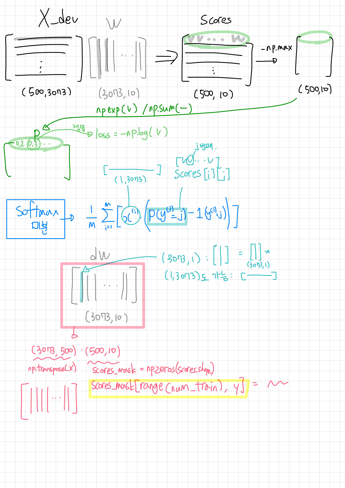

# cs231n
jihye's cs231n (2018) assignments

## notes
### Vectorized implementation

* knn
<figure>
    
</figure>

* svm
<figure>
  
</figure>

* Softmax
  - [softmax derivative](http://ufldl.stanford.edu/wiki/index.php/Softmax_Regression#Cost_Function)

<figure>
  
</figure>

* Back-propagation

<figure>
  
</figure>

